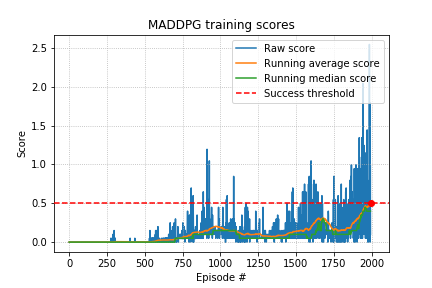
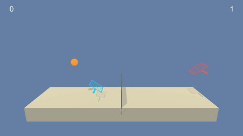

# Project report

This report details the experiments the repo owner has made to solve the collaboration and competition project of Udacity Deep Reinforcement Learning nanodegree.


## Learning algorithm

In order to have room for improvements, the agent was trained using DDPG with experience replay. DDPG uses two networks:

- the actor approximates the optimal policy deterministically $argmax_a Q(s, a)$
- the critic learns to evaluate the optimal action value function with actor's best believed action: $Q(s, \mu(s; \theta_\mu); \theta_Q)$

In DQN, you have two copies of the network (regular and target) and target network is updated every N steps.

In DDPG, target networks (one for actor, one for critic) are updated using soft updates strategy: every step, 99.99% of target and 0.01% of regular network


**Model architecture**

The model architecture is a succession of 3 fully connected layers (the hidden layers having 400 and 300 output features respectively), with ReLU activations. Optionally, batch normalization and dropout layers can be added after penultimate layers. This was added to prevent potential overfitting, which did not turn out to be a problem to reach the target score. Batch normalization layer was only added after the first FC layer.


**Hyperparameters**

With default parameters, reaching the target score of `+0.5` would take ~2000 episodes. 

```python
buffer_size = 1e6 # number of experiences that can be stored in buffer
batch_size = 128 # number of experiences that are sampled by the buffer
lr = 1e-3
gamma = 0.99
tau = 1e-3
update_freq = 20 # number of steps before next update
nb_updates = 10 # number of updates performed
noise_mean = 0. # mean of Ornstein-Uhlenbeck noise
noise_theta = 0.05 # theta parameter Ornstein-Uhlenbeck noise
noise_sigma = 0.15 # sigma parameter of Ornstein-Uhlenbeck noise
eps = 1.0 # initial noise scaling
eps_decay = 0.99 # noise scaling decay
grad_clip = 1. # gradient clipping
```


Despite experiments with hyperparameters, the training is still unstable and depending on the seed, results may not be similar.


## Results

Using the training setup described in the previous section, the training script is able to yield a consistent solving of the environment under 2000 episodes. Below are the score statistics of the training run:



Now, the evaluation script uses the state dictionary of the trained agent to evaluate it in a non-training environment and the overall score remains consistently above `+0.5`, as shown in the evaluation run below:



Trained model parameters can be downloaded from this repository [release attachments](https://github.com/frgfm/drlnd-p3-collaboration-competition/tags).


## Further improvements

- Implement [Prioritized Experience replay](https://arxiv.org/abs/1511.05952) to improve the experience sampling by the buffer.
- Improve exploration robustness with hyperparameter tuning

